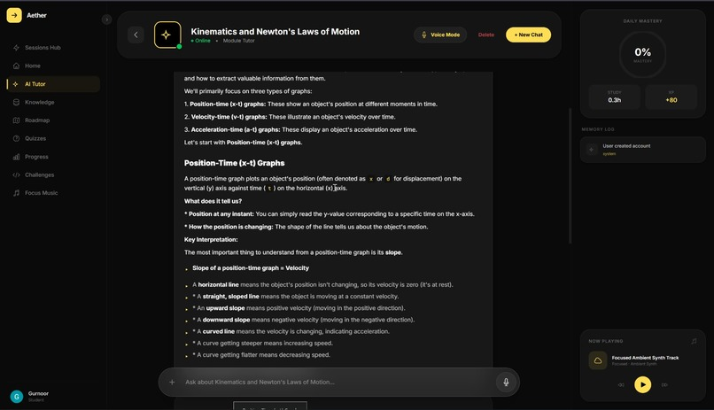
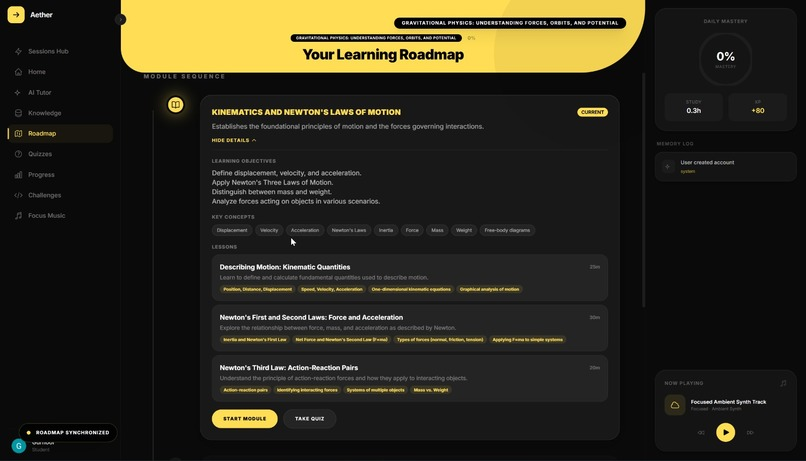
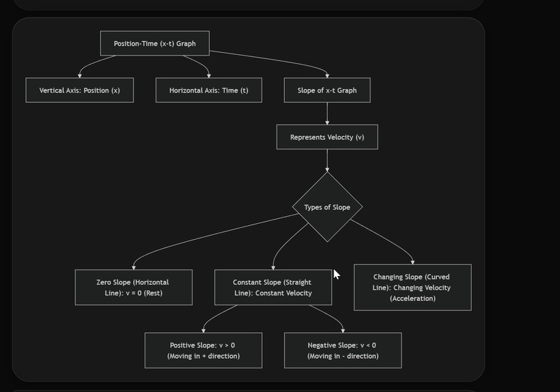
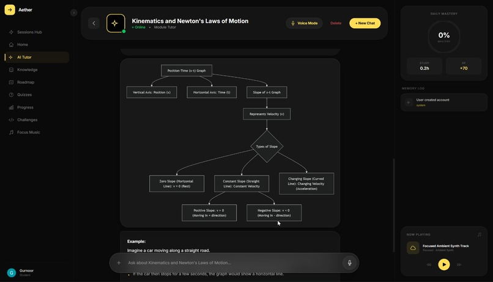
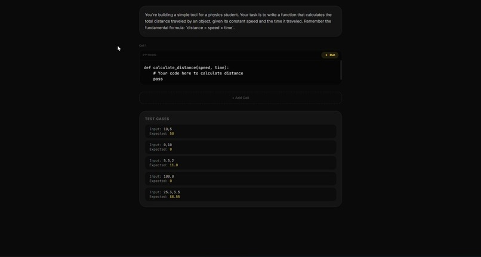
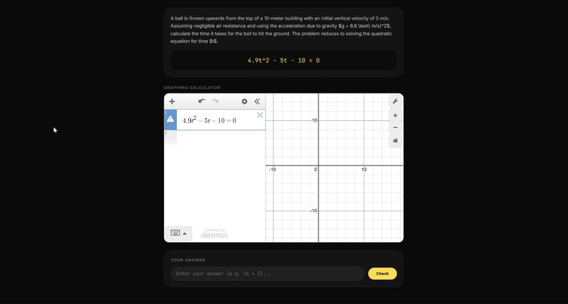
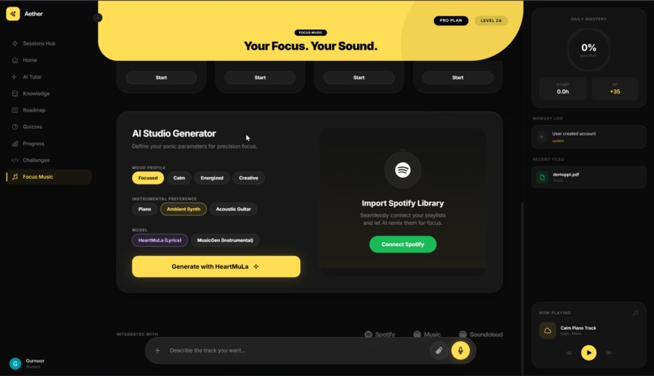

# Aether

Aether is an AI learning platform. You upload your notes, PDFs, links, whatever you're studying, and it builds a roadmap around them. Then it teaches you module by module, quizzes you as you go, and adjusts to how you actually learn.

**Still in beta, gng.** You might run into some bugs. If you do, please report them to me (gurnoor.tamber.x.01@gmail.com or via the Discord below). This is only the start of my Aether journey, and every bug you report makes it better fr.

> **Note on study music:** The music generation feature might not work right now. The model is hosted in a Google Colab notebook, so it's only online while that Colab session is running. I'm working on moving it to a permanently hosted server. But you can see it in action in the demo video below.

Check out the demo video to see it in action: https://youtu.be/Adcq0bVabeU?si=0l5Pa1uXiQevhbf-

Please check it out. It was my first video ever made lol, and if you vibe with it, go drop a like. It really helps a small dev out. I also have a Discord server where I share updates: https://discord.gg/c9tZsYGH

## What it does

**Chat with your own stuff.** This chat is powered by Gemini 2.5 Flash, but it's not a chatbot, it's something else. It reads your documents and answers from them, and it cites which document and page it got the info from. It also remembers what you have learned, and adapts its tone and difficulty level to you.

**Knowledge base (RAG).** Upload PDF, PPTX, or a Google Drive link, or even a YouTube video. It automatically extracts the transcript. The docs are broken up into chunks, stored as 768-dimensional vectors, and then searched with pgvector. All of the content is scoped per user, so you will only ever see content that is yours.

**Roadmaps.** Tell Aether what you want to learn, it will create a roadmap of 4 to 6 modules with actual lessons, learning objectives, key concepts and time estimates. As you complete the modules, they will unlock to show you the next one.

**Quizzes and challenges.** Module- or subject-specific multiple choice quizzes, automatically generated with explanations, which are graded on the spot. Starter code for coding challenges, hidden test cases for the math challenges (in LaTeX), and you can run code right in the browser (Python, JavaScript, or Rust).

**Voice.** Talk to Aether or have lessons read to you. These functions are both pre-installed: speech-to-text and text-to-speech.

**Study music.** Generate focus tracks from a mood and instrument, with short generated lyrics, and save them to playlists. Currently limited. See the note above about the Colab-hosted model.

**Progress tracking.** It remembers your study streak, gives mastery per subject, quiz history, and session analytics.

## Tech stack

| Layer | Technology |
|---|---|
| Framework | Next.js (App Router, React, TypeScript) |
| Database and auth | Supabase (Postgres, Google OAuth, storage, RLS) |
| AI | Google Gemini 2.5 Flash (chat, roadmaps, quizzes, challenges, embeddings) |
| Retrieval | pgvector semantic search with 768-dim embeddings |
| Voice | Deepgram (speech-to-text + text-to-speech) |
| In-browser code | Pyodide (Python), Web Worker (JS), Rust Playground API |
| Rendering | KaTeX (LaTeX), Mermaid.js (diagrams), Tailwind CSS |

## Gallery

  
  

  
  

  
  

  

